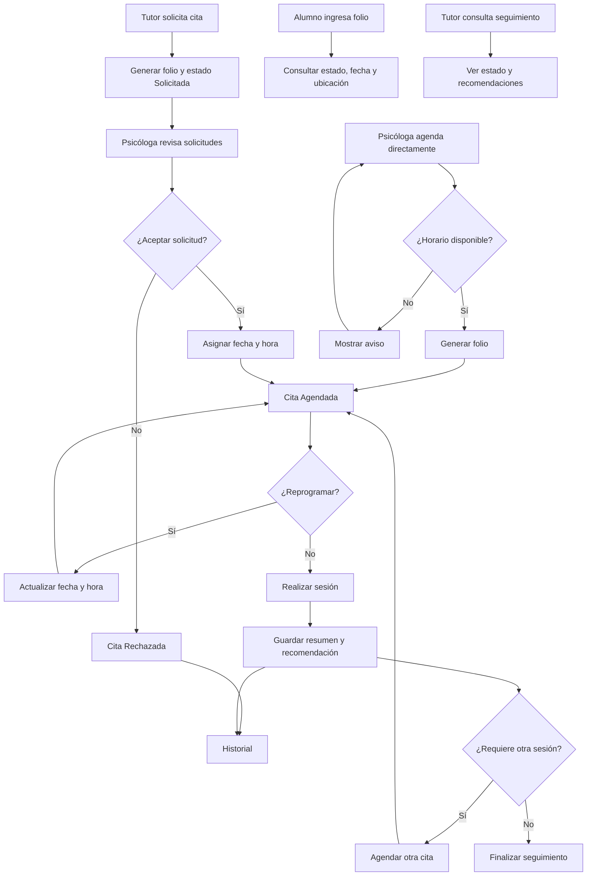

## 2. Diagrama de flujo de citas

```mermaid
flowchart TD
    A[Tutor solicita cita] --> B[Generar folio y estado Solicitada]
    B --> C[Psicóloga revisa solicitudes]
    C --> D{¿Aceptar solicitud?}
    D -->|Sí| E[Asignar fecha y hora]
    D -->|No| F[Cita Rechazada]
    F --> K[Historial]

    P[Psicóloga agenda directamente] --> Q{¿Horario disponible?}
    Q -->|Sí| R[Generar folio]
    Q -->|No| S[Mostrar aviso]
    S --> P
    R --> G
    E --> G[Cita Agendada]

    G --> H{¿Reprogramar?}
    H -->|Sí| I[Actualizar fecha y hora]
    I --> G
    H -->|No| J[Realizar sesión]

    J --> L[Guardar resumen y recomendación]
    L --> K
    L --> M{¿Requiere otra sesión?}
    M -->|Sí| N[Agendar otra cita]
    N --> G
    M -->|No| O[Finalizar seguimiento]

    U[Alumno ingresa folio] --> V[Consultar estado, fecha y ubicación]
    W[Tutor consulta seguimiento] --> X[Ver estado y recomendaciones]
```